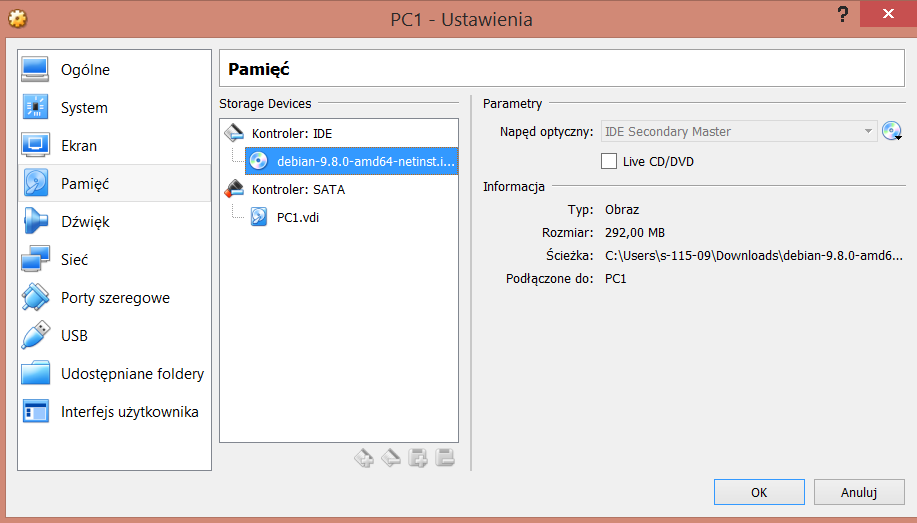
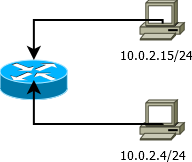

System operacyjny w środowisku sieciowym
=========================================

Charakterystyka systemu operacyjnego
------------------------------------

| Charakterystyka | wartość           | komentarz |
| ------------- |:-------------:| -----:|
| nazwa      | linux | debian 9.8 |

Konfiguracja połączenia sieciowego
----------------------------------

| Parametr | wartość           | komentarz |
| ------------- |:-------------:| -----:|
| Adres IP      | 10.0.2.15/24 | przydzielony przez DHCP ip address, ip a / ip a show dev enp0s3  |
| Maska podsieci      | 255.255.255.0 |  |
| Brama      | 10.0.2.0 | ip r / ip route |
| DNS 1      | 10.10.0.8 | cat etc/resolve.conf |
| DNS 2      | 10.10.0.4 |  |

Schemat sieci
-------------

