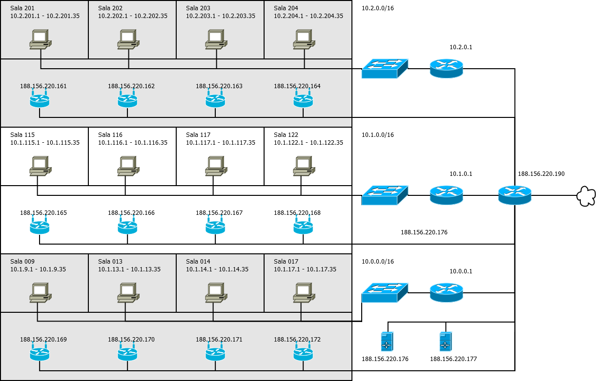

# Zadanie 2

## Projekt sieci lokalnej dla jednostki dydaktycznej uniwersytetu

### Cel Projektu

  Zaprojektowanie i weryfikacja działania sieci w środowisku testowym. 
  Rozwiązanie zapewnia dostęp do internetu dla wszystkich urządzeńw infrastrukturze.

### Założenia projektu

-   Sieć zlokalizowana jest w budynku 3 kondygnacyjnym
-   Na kążdej z kondygnacji znajdują się laboratoria komputerowe kolejno:
    -   poziom 0 
        -   009, 013, 014
    -   poziom 1
        -   115, 116, 117, 122
    -   poziom 2
        -   201, 202, 203 
-   Każde z laboratoriów wyposażone jest w 35 stanowisk dla uczestników kursów
-   Jednostka planuje otworzenie kolejnych laboratoriów 017 oraz 204
-   Każda kondygnacja wyposażona jest w izolowaną sieć Wi-Fi, udostępniajacą sieć internet podłączonym gościom
    -   Sieć Wi-Fi nie pozwala na bezposrednią komunikację z urządzeniami zlokalizowanymi w pozostałej części sieci,
        tj: laboratoria, serwery jednostki
    -   Prognozowana maksymalna liczba jednoczesnych urządzeń podłączonych do sieci to `800`
-   Jednostka posiada przyłącze internetowe oraz dysponuje pulą adresów `188.156.220.160/27`
-   Jednostka posiada serwery udostępniajace zasoby do celów dydaktycznych i promocyjnych
    -   serwery zlokalizowane są w osobnym pomieszczeniu
    -   udostępniają zasoby w sieci publicznej z wykorzystaniem sieci `188.156.220.160/27`
    -   Jeden serwer pełni rolę bramy dla urządzań w sieci lokalnej `LAN`

### Wstępne założenia

-   Każde laboratorium posiada oddzielną podsieć pozwalającą efektywnie zidentyfikować urządzania
    -   kondygnacja oraz sala
-   Dla uniknięcia zbyt słabego zasięgu sieć WiFi zostanie wyposażona w 4 urządzenia nadawcze na każdej kondygnacji

#### zadanie - wymaganai

-   Dokonaj podziału i projektu sieci w formie dokumentu w formacie `MARKDOW` zawierającego specyfikację tekstową oraz obrazkową
    projektowanej sieci
-   Przygotuj prototyp rozwiązania z wykorzystaniem oprogramowania `VirtualBox` lub podobnego.
-   W specyfikacji uwzględnij wielkości sieci oraz ich adresy
-   W specyfikacji uwzględnij konfigurację tablicy routingu
-   Dokumentację graficzną stworzonej architektury przygotuj w programie `DIA` lub podobnym

* * *

Pula adresów: 188.156.220.160/27 

IP:	        10111100.10011100.11011100.10100000 ``188.156.220.160\`

maska:	    11111111.11111111.11111111.11100000 ``255.255.255.224\` 

BIT AND     10111100.10011100.11011100.10100000 = `188.156.220.160/27` (adres sieci) 

BIT NOT     00000000.00000000.00000000.00011111 = 0.0.0.31 + adres sieci = `188.156.220.191` (broadcast)

max hostów    2^5 - 2 = 30

host min	`188.156.220.161`	

host max	`188.156.220.190`

Sieć lokalna
Jeśli chcemy `efektywnie zidentyfikować urządzania kondygnacja oraz sala` 
możemy sieć `10.0.0.0/14` zaprojektować wg `10.[pietro].[sala].[stanowisko]`
i podzielic na 3 główne podsieci

* * *

| Podsieć | Adres podsieci | Zakres                  | Adres Rozgłoszeniowy |
| ------- | :------------- | :---------------------- | :------------------- |
| 0       | 10.0.0.0	/16   | 10.0.0.1 - 10.0.255.254 | 10.0.255.255         |
| 1       | 10.1.0.0	/16   | 10.1.0.1 - 10.1.255.254 | 10.1.255.255         |
| 2       | 10.2.0.0	/16   | 10.2.0.1 - 10.2.255.254 | 10.2.255.255         |

