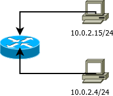
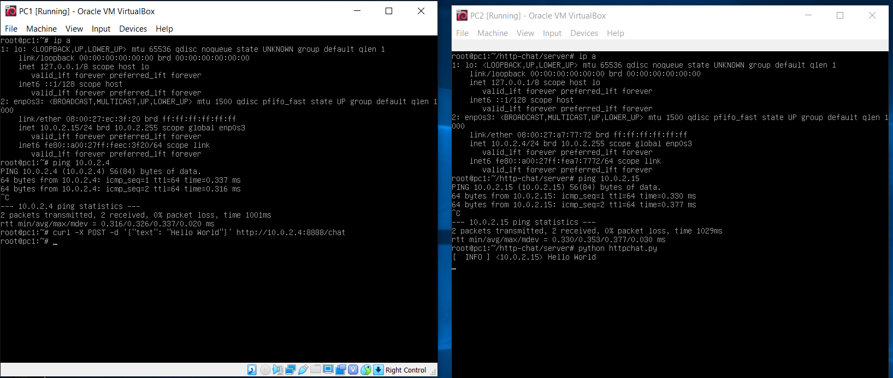
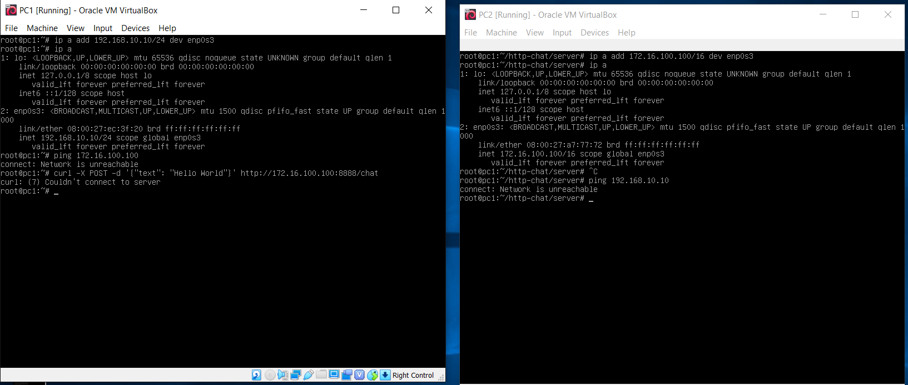
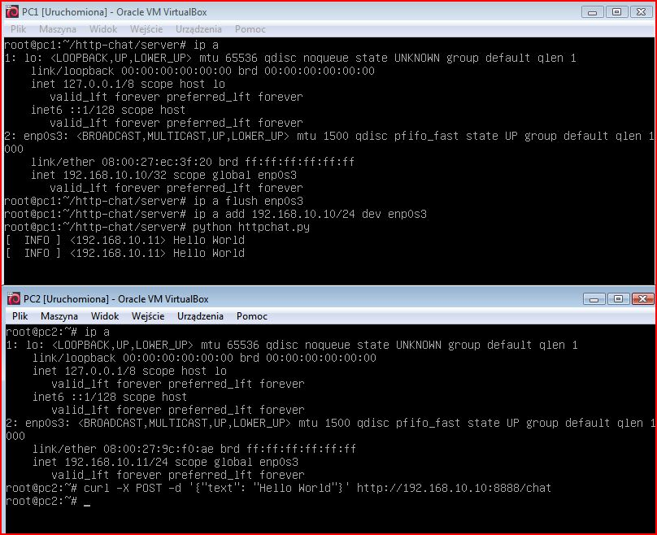

Ustawianie parametrów sieci
---------------------------

1. na 1 z komputerów zainstaluj oprogramowanie ``http-chat`` dostępne pod adresem ``https://github.com/jkanclerz/http-chat``

Wejściowe parametry sieci
-------------------------
| Parametr | wartość | komentarz(opcionalny) |
| ------------- |:-------------:| -----:|
|   PC 1 |  | debian
| IP - address  | 10.0.2.15 | |
| MASKA  | 255.255.255.0 | /24 |
|   |  | |
| PC 2  | | debian |
| IP - address  | 10.0.2.4 | |
| MASKA  | 255.255.255.0 | /24 |


Weryfikacja połączenia

Polecenie
```
ping 10.0.2.15
curl -X POST -d '{"text": "Hello World"}' http://10.0.2.15:8888/chat
```


Efekt



Statyczna konfiguracja parametrów połączenia
Wejściowe parametry sieci
-------------------------
| Parametr | wartość | komentarz(opcionalny) |
| ------------- |:-------------:| -----:|
|   PC 1 |  
| IP - address  | 192.168.10.10 | |
| MASKA  | 255.255.255.0 | |
|   |  | |
| PC 2  |  | |
| IP - address  | 172.16.100.100 | |
| MASKA  | 255.255.0.0 | |


Weryfikacja połączenia

Polecenie
```
ping 172.16.100.100
curl -X POST -d '{"text": "Hello World"}' http://172.16.100.100:8888/chat
```

Efekt


Nowa statyczna konfiguracja 

```
ip addr flush enp0s3
ip addr add 192.168.10.10.dev enp0s3
ip a show dev enp0s3
```
-------------------------
| Parametr | wartość | komentarz(opcionalny) |
| ------------- |:-------------:| -----:|
|   PC 1 |  
| IP - address  | 192.168.10.10/24 | |
| MASKA  | 255.255.255.0 | |
|   |  | |
| PC 2  |  | |
| IP - address  | 192.168.10.11/24 | |
| MASKA  | 255.255.255.0 | |


Weryfikacja połączenia

Polecenie
```
ping 192.168.10.10
curl -X POST -d '{"text": "Hello World"}' http://192.168.10.10:8888/chat
```

Efekt



Warto wiedzieć
--------------

-------------------------
| Parametr | wartość | komentarz(opcionalny) |
| ------------- |:-------------:| -----:|
| Lokalizacja pliku z konfiguracją sieci| ``/etc/network/interfaces`` | |
| UP -> Wyłączenie interfejsu sieciowego| ``ip link set {interface} down`` ||
| DOWN -> Włączenie interfejsu sieciowego| ``ip link set {interface} up``||
| Sprawdzenie obecnych parametrów | ``ip a`` | |
| lista wszystkich interfejsów | ``ip link show ``| |
| Które interfejsy jakie porty słuchają | ``netstat`` | |
