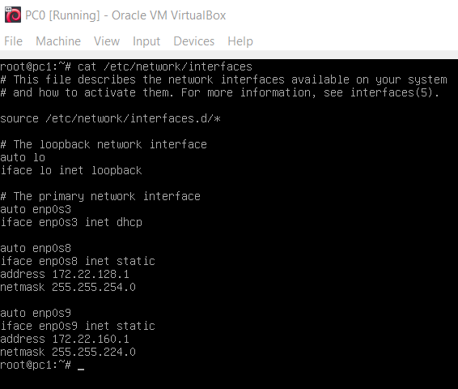
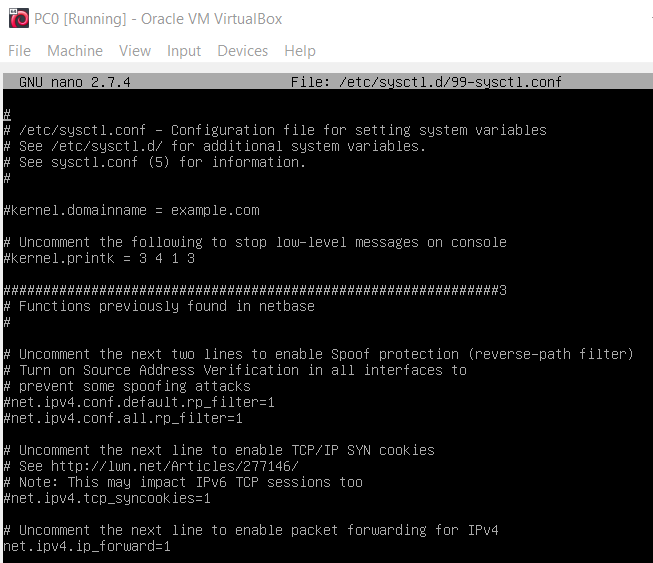
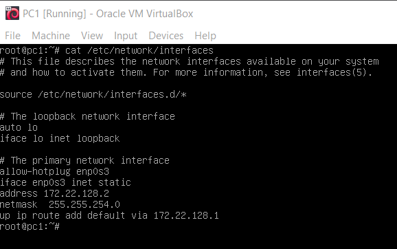
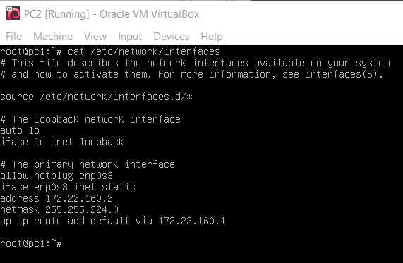
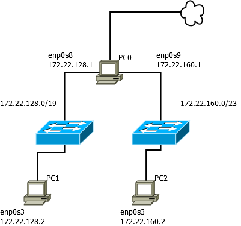

## Zadanie 1

1.  Zaprojektuj oraz przygotuj prototyp rozwiązania z wykorzystaniem oprogramowania `VirtualBox` lub podobnego. 
    Zaproponuj rozwiązanie spełniające poniższe wymagania:
    -   Usługodawca zapewnia domunikację z siecią internet poprzez interfejs `eth0` `PC0`
    -   Zapewnij komunikację z siecią internet na poziomie `LAN1` oraz `LAN2`
    -   Dokonaj takiego podziału sieci o adresie `172.22.128.0/17` aby w `LAN1` można było zaadresować `500` adresów natomiast w LAN2 `5000` adresów    
    -   Przygotuj dokumentację powyższej architektury w formie graficznej w programie `DIA`

* * *

|                       | adres dec       | adres bin                           | komentarz                  |
| --------------------- | --------------- | ----------------------------------- | -------------------------- |
| IP                    | 172.22.128.0    | 10101100.00010110.10000000.00000000 |                            |
| maska                 | 255.255.128.0   | 11111111.11111111.10000000.00000000 |                            |
| adres sieci (bit and) | 172.22.128.0/17 | 10101100.00010110.10000000.00000000 | bit and ip i maski         |
| adres rozgłoszeniowy  | 172.22.255.255  | 10101100.00010110.11111111.11111111 | bit or maski + adres sieci |
| host min              | 172.22.128.1    |                                     |                            |
| host max              | 172.22.255.254  |                                     |                            |

  LAN1: 
  2^(32 – n) – 2 >= 500
  2^9 - 2 = 512
  n = 23\
  Maska = 11111111.11111111.11111110.00000000 = 255.255.254.0 

  LAN2: 
  2^(32 – n) – 2 >= 5000
  2^13 - 2 = 512
  n = 19\
  Maska = 11111111.11111111.11100000.00000000 = 255.255.224.0 

| Podsieć | Adres podsieci                       | Adres Rozgłoszeniowy                  | Zakres                        |
| ------- | :----------------------------------- | :------------------------------------ | :---------------------------- |
| LAN2    | 172.22.128.0/19                      | negacja maski + adres podsieci =      |                               |
|         |                                      | 00000000.00000000.00011111.11111111 = |                               |
|         |                                      | 0.0.31.255 = 172.22.159.255           | 172.22.128.1 - 172.22.159.254 |
| LAN1    | broadcast poprzedniej podsieci + 1 = |                                       |                               |
|         | 172.22.160.0/23                      | 00000000.00000000.00000001.11111111 = |                               |
|         |                                      | 0.0.1.255 = 172.22.161.255            | 172.22.160.1 - 172.22.161.254 |

 PC0 \

 PC1 \

 PC2 \

 
 Diagram \
 
